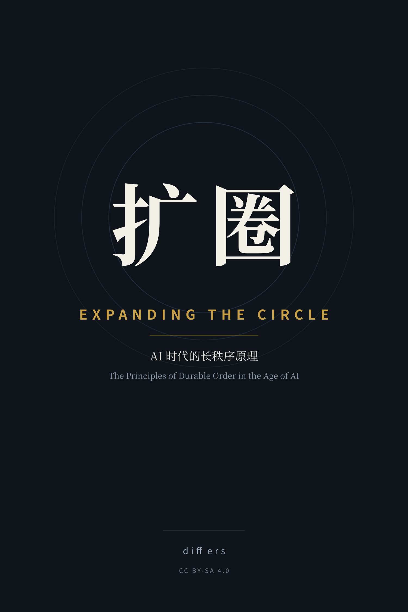

# 扩圈 / Expanding the Circle

### AI 时代的长秩序原理
### The Principles of Durable Order in the Age of AI

> **一个秩序能活多久，取决于它把多少人算作「我们」。**
> *How long an order survives depends on how many people it counts as "we."*

**Bilingual edition · 中英双语**

---

## 这是什么书 / What this book is

**《扩圈》**讨论一个古老而紧迫的问题：**什么样的秩序，能活得比缔造它的人更久？**

它的答案不是「更聪明」「更强」「技术更先进」，而是一件更朴素的事——**秩序的边界，就是「圈」的边界；圈的半径，决定秩序的寿命。** 窄圈靠恐惧与榨取维持，爆发力强，衰亡极快；宽圈靠信用与互惠维持，启动慢，极其耐用。

这不是道德判决，是**统计结果**。站在 AI 时代的路口，这个问题第一次变得生死攸关：**当机器可以替代绝大多数人的经济功能，统治者是否还需要「人民」？** 本书的回答是——需要，而且比以往任何时候都更需要。

**难度**：无门槛。不需要经济学或政治学背景。
**篇幅**：序言 + 十三章 + 结语 + 后记，约 5 万字。

---

## 目录

### 中文版 `book/`
- [序言 · 一个统治者的问题](book/00-preface.md)
- **第一部 · 根基**
  1. [圈：秩序的第一原理](book/01-circle.md)
  2. [守信：承诺是最贵的资产](book/02-credibility.md)
  3. [互惠：合作的复利](book/03-reciprocity.md)
  4. [规则：把善意外化成制度](book/04-rules.md)
- **第二部 · 陷阱**
  5. [道德优越论：最高效的自毁装置](book/05-moral-superiority.md)
  6. [坐寇与流寇：统治者的真实算术](book/06-stationary-bandit.md)
  7. [收紧的圈：为什么清洗总以崩塌收场](book/07-purging.md)
- **第三部 · 扩张**
  8. [圈的半径与代价：大同与团结的张力](book/08-radius-cost.md)
  9. [容纳异己：扩张的机制](book/09-inclusion.md)
  10. [分利：谁承担扩张的成本](book/10-dividend.md)
- **第四部 · 当代**
  11. [AI 时代：圈的新边疆](book/11-ai-frontier.md)
  12. [从人治到自治：秩序的最后一公里](book/12-self-governance.md)
  13. [归属：AI 红利的分配算术](book/13-ownership.md)
- [结语 · 身份与选择](book/99-epilogue.md)
- [后记 · 从一场争论开始](book/afterword.md)

### English Edition `en/`
- [Preface · A Ruler's Question](en/00-preface.md)
- **Part I · Foundations**: [1. The Circle](en/01-circle.md) · [2. Credibility](en/02-credibility.md) · [3. Reciprocity](en/03-reciprocity.md) · [4. Rules](en/04-rules.md)
- **Part II · Traps**: [5. Moral Superiority](en/05-moral-superiority.md) · [6. Stationary and Roving Bandits](en/06-stationary-bandit.md) · [7. Purging](en/07-purging.md)
- **Part III · Expansion**: [8. The Radius and Its Cost](en/08-radius-cost.md) · [9. Inclusion](en/09-inclusion.md) · [10. Dividing the Gains](en/10-dividend.md)
- **Part IV · The Present**: [11. The AI Frontier](en/11-ai-frontier.md) · [12. Self-Governance](en/12-self-governance.md) · [13. Ownership](en/13-ownership.md)
- [Epilogue · Identity and Choice](en/99-epilogue.md) · [Afterword](en/afterword.md)

> 英文版由机器翻译、人工审校，术语规范见 [`en/GLOSSARY.md`](en/GLOSSARY.md)。
> The English edition is machine-translated and human-reviewed; see the glossary for terminology.

---

## 怎么读 / How to read

- **如果你手中有权**：把它当一份检查表。每一条制度、每一个决策，问一句——**它把多少人算作「我们」？**
- **如果你无权**：把它当诊断工具。看清自己处在哪个圈层，以及这套秩序还能撑多久。
- **如果你只想读一章**：读第 11 章「AI 时代」。

---

## 构建电子书 / Build

需要 [pandoc](https://pandoc.org/)。生成印刷级 PDF 需要 `chromium`/`google-chrome` 与 `pdfunite`；生成封面需要 `python3` 与 `inkscape`。

```bash
./build/build.sh              # 中文版：EPUB + HTML
./build/build.sh pdf          # 中文版：另生成印刷级 PDF（含封面）
./build/build.sh en pdf       # 英文版
./build/build.sh all pdf      # 中英双语，全部格式
```

> 若 pandoc 缺少数据模板：`PANDOC_DATA_DIR=/path/to/pandoc/data ./build/build.sh`

产物在 `build/`（`扩圈.epub` / `扩圈.pdf` / `Expanding-the-Circle.*`）。

---

## 贡献 / Contributing

这是一份开源文本，欢迎 Issue / PR：修正史实、补充案例、改进翻译。
写作规范见 [`STYLE.md`](STYLE.md)，翻译术语见 [`en/GLOSSARY.md`](en/GLOSSARY.md)。

**唯一底线：不确定的史实不要写，宁可少写，不可编造。**

---

## 许可 / License

[CC BY-SA 4.0](LICENSE) — 可自由复制、传播、改编，须署名并以相同方式共享。
